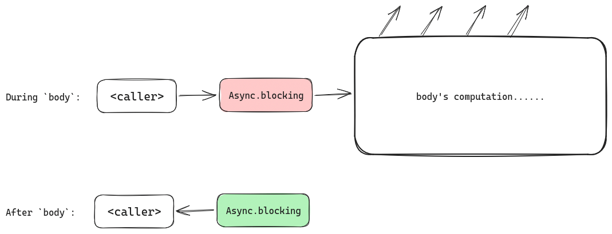
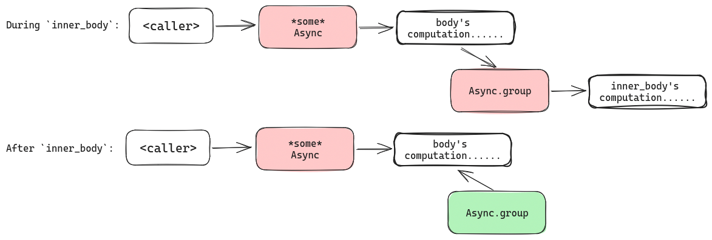
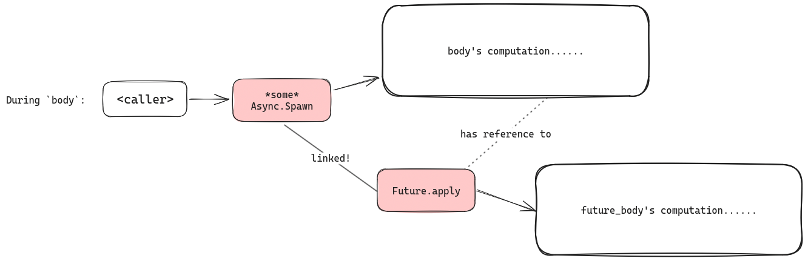
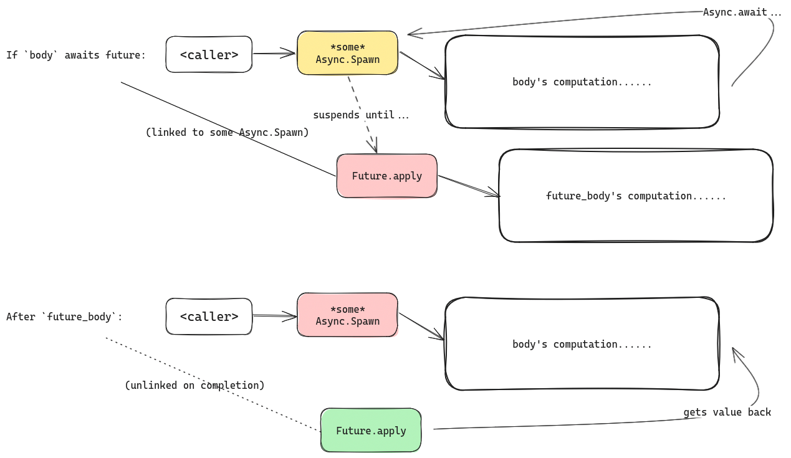
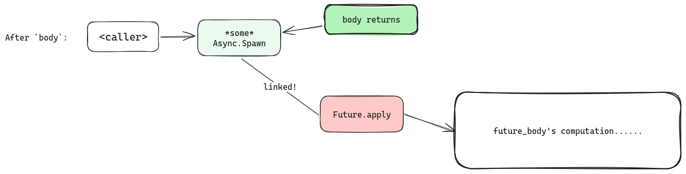
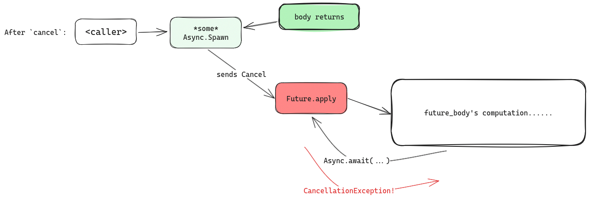

# Groups, Scoping and Structured Concurrency

If you've been following the book thus far, you've seen a lot of mentions of
"an `Async` scope" and "sub-scoping". What exactly are those "scopes", and why
do they matter?

That's exactly what this section is about!


## tl;dr: Gears Structured Concurrency

We can sum up the content of this section as below. For more details, read on!

1. `Async` contexts form a tree, rooted by `Async.blocking`, each node associated by a `body` computation.
   All `Async` contexts only returns after `body` completes.
2. A child `Async` context can be created by either
   - `Async.group`, creating a direct child context "blocking" its caller, granting `Async.Spawn`.
   - `Future.apply`, branching a concurrent computation linked to the current `Async` context.
3. **When `body` completes, all linked `Future`s are cancelled, and the `Async` context returns after the cancellation is
   completely handled.**

With these three properties, we guarantee that calling `using Async` functions will properly _suspend_ if needed,
and _cleans up_ properly on return.


## In Gears, Async scopes form a tree

Let's look at the *only* three[^task_start] introduction points for an `Async` context in `gears.async`, and examine their signatures:

1. [`Async.blocking`](https://lampepfl.github.io/gears/api/gears/async/Async$.html#blocking-9c3)'s signature is
   ```scala
   object Async:
     def blocking[T](body: Async.Spawn ?=> T)(using AsyncSupport, Scheduler): T
   ```
   Just as the name suggest, `Async.blocking` gives you an `Async` context *from thin air*, but in exchange,
   whatever suspending computation happening in `body` causes `blocking` to **block**. Hence, `blocking` only
   returns when `body` gives back a `T`, which `blocking` happily forwards back to the caller.

   Looking at it from the perspective of the call stack, `blocking` looks like this...
   
   Pretty simple, isn't it? With `blocking`, you run suspending code in a scope that cleans up itself, just
   like returning from a function!

2. [`Async.group`](https://lampepfl.github.io/gears/api/gears/async/Async$.html#group-fffff393)'s signature is
   ```scala
   object Async:
     def group[T](inner_body: Async.Spawn ?=> T)(using Async): T
   ```
   `Async.group` takes an `Async` scope, and starts a *child* scope under it. This scope inherits the suspend
   and scheduling implementation of the parent `Async`, but gives the `inner_body` a scope of its own...
   
   It is actually almost the exact same as `Async.blocking` from the perspective of the caller (with an `Async` context!)
   `Async.group` also "blocks" (suspending if possible, of course) until `inner_body` completes.

   So far so good, and our scope-stack is still a linear stack! Let's introduce concurrency...
3. **Finally**, [`Future.apply`](https://lampepfl.github.io/gears/api/gears/async/Future$.html#apply-fffffebf)'s signature is
   ```scala
   object Future:
     def apply[T](future_body: Async.Spawn ?=> T)(using Async.Spawn): T
   ```
   `Future.apply` *starts* a concurrent computation that is *bound* to the given `Async.Spawn` scope. What does that mean?
   Looking at the call stack...
   
   We can see that `Future.apply` immediately returns (to `body`) a reference to the `Future`.
   In the meantime, a *new* `Async.Spawn` scope (named `Future.apply` here) is created, running `future_body`.
   It is *linked* to the original `Async.Spawn` passed into `Future.apply`.

   We can now see that `Async` scopes, with both its associated `body` and linked `Future.apply`'s `Async` scopes,
   now forms a tree!

To illustrate what exactly happens with linked scopes as the program runs, let's walk through the cases of interactions between
the scopes!

[^task_start]: Technically [`Task.start`](https://lampepfl.github.io/gears/api/gears/async/Task.html#start-fffff9cb)
also introduces an `Async` context, but it is exactly equivalent to `Future.apply(Task.run())`.

## Interactions between scopes

### `.await`ing a `Future`

When you `.await` a future, the `Async` scope used to `.await` on that Future will _suspend_ the computation until the
Future returns a value (i.e. its `future_body` is complete).



Note that the `Async` context passed into `.await` does *not* have to be the same `Async.Spawn` context that the `Future`
is linked to!
However, for reasons we'll see shortly, active `Future`s will always be linked to one of the ancestors of `body`'s `Async` context
(or the same one).

Another thing to note is that, upon completion, the `Future` unlinks itself from the `Async.Spawn` scope.
This is not very important, as the `Future` already has a return value! But it is a good detail to notice when it comes to cleaning up.

### Cleaning up: after `body` completes

What happens when `body` of an `Async` context completes, while some linked `Future` is still running?



In short: **When `body` completes, all linked child scopes are `.cancel()`-ed, and `Async` will _suspend_ until no more
child scopes are linked** before returning.

This is especially important!
It means that, _futures that are never `.await`ed will get cancelled_. **Make sure to `.await` futures you want to complete!**


### Cleaning up: when `cancel` is signalled

During a `Future`'s computation, if it is `.cancel`-ed mid-way, the body keeps running (as there is no way to suddenly
interrupt it without data loss!)

*However*, if `.await` is called with the `Future`'s `Async` context (i.e. a request to suspend), it will immediately
throw with a `CancellationException`.
The `body` may catch and react to this exception, e.g. to clean up resources.

The `Future` context will only attempt to unlink _after_ body has returned, whether normally or by unwinding an exception.



## Delaying cancellation with `uninterruptible`

The above `.await` behavior (throwing `CancellationException`) can be _delayed_ within a Future by running the code under an
`uninterruptible` scope.
This is useful for asynchronous clean-up:

```scala
Future:
  val resource = acquireResource()
  try
    useResource(resource)
  finally
    Async.uninterruptble:
      resource.cleanup()/*(using Async)*/
```
without `uninterruptble`, suspensions done by `resource.cleanup` will again throw `CancellationException`s.
