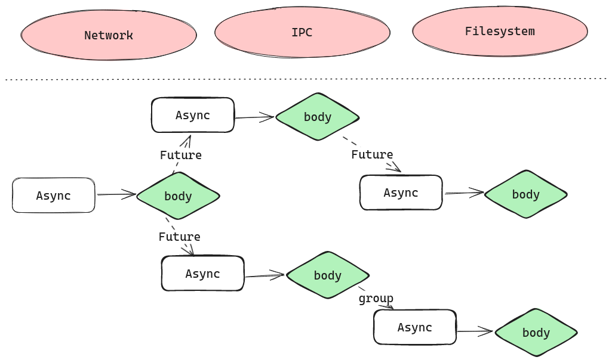
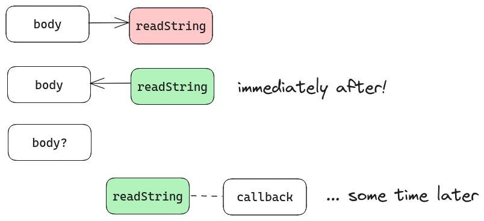
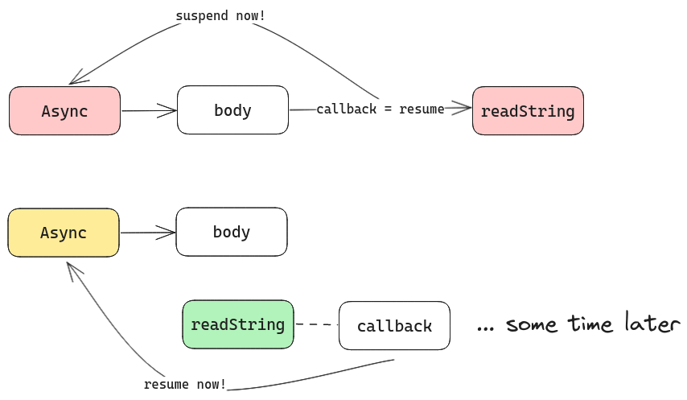

# Sources as a Concurrency Primitive

With [async functions](../basic/using_async.md), [active Futures](../basic/futures.md) and [channels](../basic/channels.md)
we should be able to write our program, and make them easily reasonable with [structured concurrency](../basic/structured_concurrency.md).

However, often we use concurrency to deal with asynchronous external events, such as file I/O, networking, sockets, ...
From the program's point of view, this is completely _unstructured_: often you ask for an operation, and at some point in the
future (out of our control), we get back a response.
This does not mix well with our current concepts, where callers _always_ manage its own execution flow and structure.



To deal with such asynchronous events, Gears provide some interfaces to be used as bridges between the unstructured world and
structured concurrency programs.
These come in the forms of [**`Async.Source`**](https://lampepfl.github.io/gears/api/gears/async/Async$$Source.html)s.

## Callbacks and push

The most basic concept of requesting an asynchronous operation is through a *callback*.

Let's illustrate this through a very simple example, of reading a file.

```scala
object File:
  def readString(path: String)(callback: Either[Error, String] => Unit): Cancellable
```

Suppose we have a non-blocking API of reading a file at `path`. The content of the file will be read into a `String`, which
is passed into `callback` (or, if errors come up, they also get passed into `callback`).
Rather than the operation result, `readString`'s caller receives a *request* object, which has a `cancel` method to attempt
to cancel the read operation.



The flow of callback-based operations is as follows:
1. `body` calls `File.readString(path)(callback)`, getting back a `Cancellable` *immediately*.
2. `body` does *not* control when or how `callback` is called, and has no provided way to interact with `callback`.

   In reality, should `body` want to _wait_ for `callback`'s result, it can either
   - Put all handling logic past `readString` into `callback`, turning `callback` into a *full continuation*.
   - Introduce blocking/suspending through some synchronization primitive (channel, mutex).

   Without `Async` the latter option introduces _blocking_ code, which effectively nullifies the advantage of using non-blocking
   API in the first place. Therefore, traditional languages with callbacks (Node.js is an infamous example) chose the former,
   creating the problem of _callback hell_.
3. At some time in the future, `callback` is called with the result. This might happen while `body` is still executing,
   or after. Depending on parallelism capabilities, it may be executed in parallel to `body`.

### How `Async` makes callbacks easier

In Gears however, we have `Async` computations: computations that can _suspend_ to wait for a future value! This means,
given the same API, we can do the following:
- _Suspend_ the current `Async` context
- Issue the asynchronous request, passing the _resumption_ of the `Async` context as the callback.



And, in essence, this is exactly what [`Async.await`](https://lampepfl.github.io/gears/api/gears/async/Async.html#) does!

Let's have a now fully-expanded signature of `Async.await`:
```scala
trait Async:
  def await[T](src: Source[T]): T
```

With our knowledge of the Async-callback flow, we know that `src` would be some callback-taking future value.
`Async.await` would then do the suspend / set-resume-callback procedure, and return the output of the `src` as if we continued
from within the callback.

This suspension/resume mechanism is how `Async` was able to let you await for concurrent `Future`s (which is also a `Source`!)
without being inside a `Future` itself, monadic style.

## The `Source` trait

Now that we have an idea of what a `Source` is, we can now look at how
[`Source`](https://lampepfl.github.io/gears/api/gears/async/Async$$Source.html) is defined:
```scala
trait Source[+T]:
  def onComplete(listener: Listener[T]): Unit

  def poll(listener: Listener[T]): Boolean
  def poll(): Option[T]

  def dropListener(listener: Listener[T]): Unit

  inline def awaitResult(using Async): T = Async.await(this)

// Included for convenience, simplified...
trait Listener[-T]:
  def apply(item: T, origin: Source[T]): Unit
```

- [`onComplete`](https://lampepfl.github.io/gears/api/gears/async/Async$$Source.html#onComplete-fbc)
does exactly what you expect: when an item is available, `listener` is called with the item.
`listener` also gets a reference to the `Source` itself, in case it was passed to multiple `Source`s and
needs to distinguish *which* source the item came from.
- [`poll(listener)`](https://lampepfl.github.io/gears/api/gears/async/Async$$Source.html#) works as a non-blocking poll:
  if an item is immediately available, call the `listener` with it immediately.
  Otherwise, immediately return `false`, and usually this means you'd want to put your listener into `onComplete` instead.

  If an item is all you need, [`poll()`](https://lampepfl.github.io/gears/api/gears/async/Async$$Source.html#poll-fffff63d)
  is a much more convenient overload: you just get the item back, or `None` if it was not immediately available.
- [`dropListener`](https://lampepfl.github.io/gears/api/gears/async/Async$$Source.html#) signals that `listener` is no longer
  needed to be called. This usually signals the cancellation of the value receiver.

  Note that this is _not_ cancelling the `Source` itself: `Source` does not have a concept of cancellation!
  Not all asynchronous operations are cancellable.

Finally, `awaitResult` is just a convenience postfix method for `Async.await`.
In special cases where `T` is `Either` or `Try` (`Future[T]` is a `Source[Try[T]]`), we have `.await` as a convenience
postfix method that also unwraps the value!

## Persistent and Ephemeral Sources

So far, things seem clear when we have one `Source` and one `Listener`.
What happens when we pass multiple listeners into a `Source`?

The answer depends a lot on _what_ the source is representing:
- Should we write the above `readString` function in terms of `Source` instead:
  ```scala
  object File:
    def readString(path: String): Source[Either[Error, String]] & Cancellable
  ```
  then the `Source` returned represents a single _asynchronous request_. This request returns once, so no matter
  how many listeners are attached to it, they should get _the same value_ every time.

  We call Sources where all listeners get the same value, resolved at the same time[^time-is-hard], a **persistent source**.
  Especially, if a source is both persistent and cancellable, it is a `Future`.
  We shall see the "real" interface of a `Future` in the next section.
  ```scala
  // "correct" definition
  object File:
    def readString(path: String): Future[Either[Error, String]]
  ```
- Suppose we want to capture signals sent to our program. We might use a signal handler like this
  ```scala
  object Signals:
    def capture(signals: Signal*): Source[Signal]
  ```
  in which our `Source` represents a _subscription_ to the system process' signal handler. This will
  deliver multiple signals to our program, and each listener attached to this `Source` should get *one*,
  *possibly different* signal.
  We call Sources that deliver possibly different values to listeners an **ephemeral source**.

  Another example of an ephemeral source is
  [`.readSource`](https://lampepfl.github.io/gears/api/gears/async/ReadableChannel.html#readSource-0) of a channel.

## Active and Passive/Reactive Sources

Activeness and Passitivity of Sources refer to whether values are resolved to the Source regardless of
interactions with it (regarding adding/removing listeners).

Some sources, like an active `Future` or an asynchronous request like `File.readString`, will complete and
resolve with a value regardless of a listener attached to it or not.

Some other sources, like `Channel.readSource`, does not do anything on creation. It only attempts to
consume a value from the channel when a listener is attached to it.

From the perspective of the `Source`, this matters when one decides to create a `Source` but not await for it.
There is no way to differentiate the two sources from the signature alone, hence this should be an anti-pattern.

[^time-is-hard]: it is hard to say that concurrent listeners are resolved "at the same time".
We usually reason about this in terms of subsequent listeners: if one listener is attached to a persistent `Source`
_after_ another has been resolved, the second listener should be resolved immediately with the same value.
Consequently, `poll`ing this `Source` will always give the same value back immediately.
